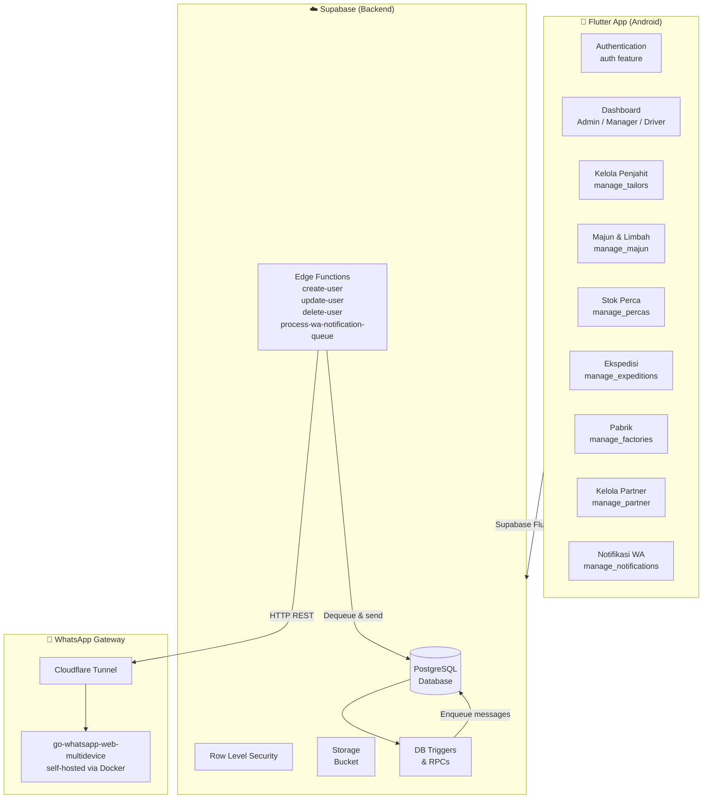
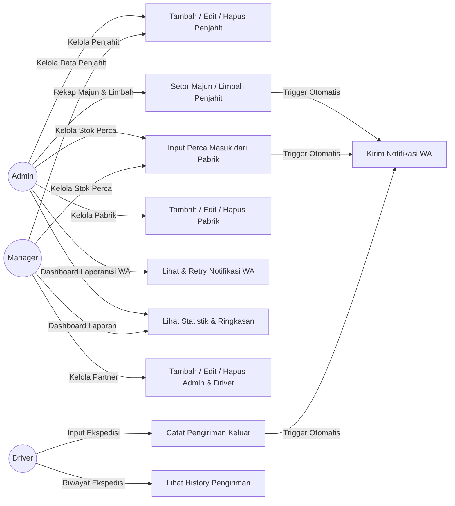
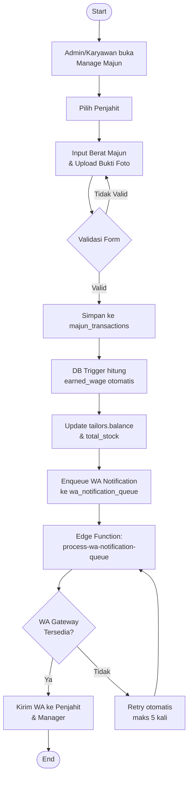

# majunkita

A Flutter mobile application for managing the **majun** (textile-waste cloth) supply chain — from tailor pickup to perca fabric stock and expedition delivery — backed by Supabase.

## Modules

| Module | Description | README |
|---|---|---|
| **Authentication** | Email/password login with role-based routing | [docs](lib/features/auth/README.md) |
| **Dashboard** | Role-specific dashboards for Admin, Manager, and Driver | [docs](lib/features/Dashboard/README.md) |
| **Penjahit (Tailor)** | Record majun collection from tailors, track wages and delivery proof | [docs](lib/features/manage_tailors/README.md) |
| **Stok Perca** | Manage incoming perca fabric stock from factories | [docs](lib/features/manage_percas/README.md) |
| **Ekspedisi** | Track outbound expedition shipments | [docs](lib/features/manage_expeditions/README.md) |
| **Manajemen Majun** | Record majun & limbah setoran transactions | [docs](lib/features/manage_majun/README.md) |
| **Pabrik (Factory)** | Manage supplier factory data | [docs](lib/features/manage_factories/README.md) |
| **Kelola Partner** | Manage admin and driver accounts | [docs](lib/features/manage_partner/README.md) |
| **Notifikasi WA** | WhatsApp notification queue and status monitoring | [docs](lib/features/manage_notifications/README.md) |

## Tech Stack

- **Frontend:** Flutter (Android)
- **Backend:** [Supabase](https://supabase.com) — PostgreSQL, Row Level Security, Storage, Edge Functions
- **WhatsApp Gateway:** [dwirez99/go-whatsapp-web-multidevice](https://github.com/dwirez99/go-whatsapp-web-multidevice) — self-hosted, exposed via Cloudflare Tunnel

## Architecture



## Use Case Diagram



## Activity Diagram — Alur Setor Majun



## Getting Started

### 1. Environment Setup

```bash
cp .env.example .env
# Fill in SUPABASE_URL and SUPABASE_ANON_KEY from your Supabase project settings
```

### 2. Apply Database Migrations

```bash
supabase db push
```

### 3. Seed Development Data (optional)

To populate the database with realistic Indonesian dummy data covering 15 months of transactions, run the seed script. See the full guide:

```
docs/seed-guide.md
```

Quick-start via Supabase CLI:

```bash
supabase db reset   # applies migrations + runs supabase/seed.sql automatically
```

Or paste `supabase/seed.sql` into the Supabase SQL Editor and click **Run**.

> ⚠️ Only run on development/staging databases — the script wipes all existing data.

### 4. Deploy Edge Functions

```bash
supabase functions deploy --project-ref <your-project-ref>
```

### 5. Run the Flutter App

```bash
flutter pub get
flutter run
```

## WhatsApp Integration

Automated WhatsApp notifications are sent to tailors and managers when transactions are recorded. See the full setup guide in:

```
docs/wa-integration-setup.md
```

## Contributing

1. Fork the repository
2. Create a feature branch (`git checkout -b feat/your-feature`)
3. Commit your changes and open a Pull Request
