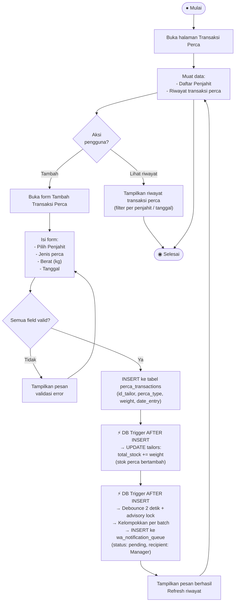

# Activity Diagram — Ambil Perca (Transaksi Perca)

**Aktor:** Admin  
**Deskripsi:** Admin mencatat pengambilan perca oleh penjahit. DB trigger mengelompokkan notifikasi per batch menggunakan debounce 2 detik dan advisory lock untuk mencegah duplikat notifikasi WA ke Manager.

## Langkah-langkah

| # | Langkah | Keterangan |
|---|---|---|
| 1 | Pilih penjahit | Dari dropdown yang memuat semua penjahit aktif |
| 2 | Isi detail | Jenis perca, berat, tanggal pengambilan |
| 3 | Validasi | Semua field wajib terisi |
| 4 | Insert DB | Transaksi disimpan ke tabel `perca_transactions` |
| 5 | Update stok | Trigger menambah `total_stock` penjahit di tabel `tailors` |
| 6 | Notif WA | Trigger mengantrekan notifikasi ke Manager dengan debounce & advisory lock (mencegah duplikat jika banyak baris masuk berurutan) |
