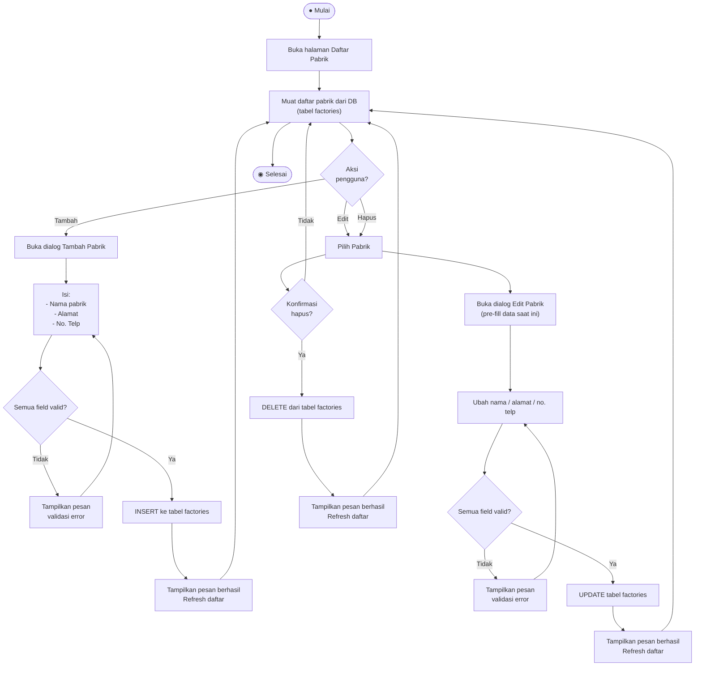

# Activity Diagram — Kelola Pabrik

**Aktor:** Admin  
**Deskripsi:** Admin dapat menambah, mengubah, dan menghapus data pabrik yang menjadi sumber perca. Data pabrik digunakan sebagai dropdown saat Driver menginput stok perca.

## Langkah-langkah

| # | Aksi | Keterangan |
|---|---|---|
| 1 | Lihat daftar | Daftar pabrik dimuat dari tabel `factories` |
| 2 | Tambah | Form dialog → validasi → INSERT ke `factories` |
| 3 | Edit | Pre-fill form dengan data saat ini → validasi → UPDATE `factories` |
| 4 | Hapus | Konfirmasi → DELETE dari `factories` |

> **Catatan:** Menghapus pabrik yang sudah terhubung dengan data `percas_stock` akan gagal karena ada foreign key constraint di database.
