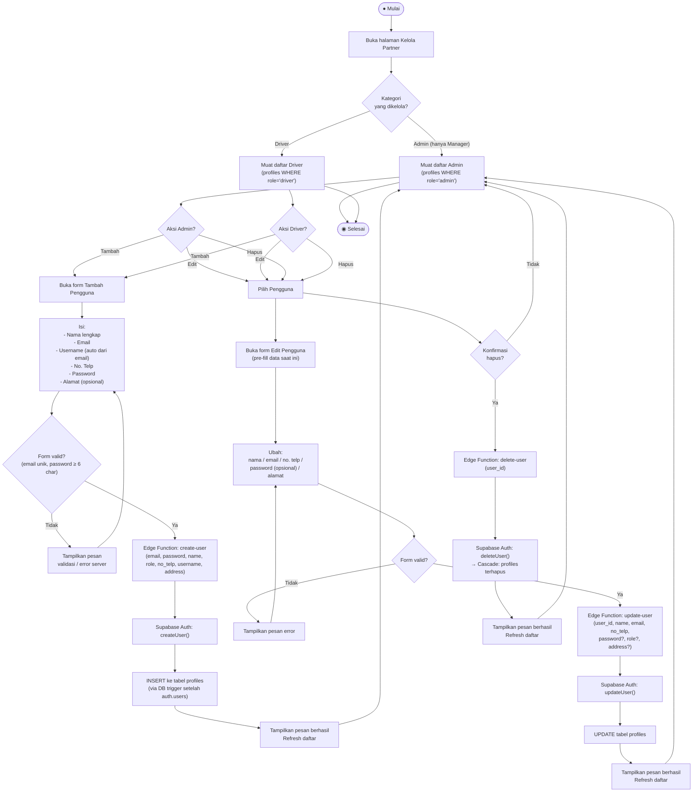

# Activity Diagram — Kelola Partner (Manajemen Pengguna)

**Aktor:** Admin (kelola Driver & Penjahit Sistem) / Manager (kelola Admin, Driver & Penjahit Sistem)  
**Deskripsi:** Admin dan Manager dapat menambah, mengubah, dan menghapus akun pengguna sistem (Admin, Driver). Pembuatan dan penghapusan akun dilakukan melalui Supabase Edge Functions karena memerlukan akses service role.

## Langkah-langkah

| # | Aksi | Keterangan |
|---|---|---|
| 1 | Pilih kategori | Admin: hanya Driver; Manager: Admin & Driver |
| 2 | **Tambah** | Form isi data → validasi → Edge Function `create-user` → Supabase Auth + profiles |
| 3 | **Edit** | Pre-fill form → validasi → Edge Function `update-user` → update Auth + profiles |
| 4 | **Hapus** | Konfirmasi → Edge Function `delete-user` → hapus dari `auth.users` (cascade ke `profiles`) |

> **Catatan:**  
> - Semua operasi CRUD pada akun pengguna melewati **Supabase Edge Functions** karena memerlukan `service_role` key.  
> - Admin **tidak dapat** mengelola sesama Admin; hanya Manager yang dapat mengelola akun Admin.  
> - Username di-generate otomatis dari bagian sebelum `@` pada email.
