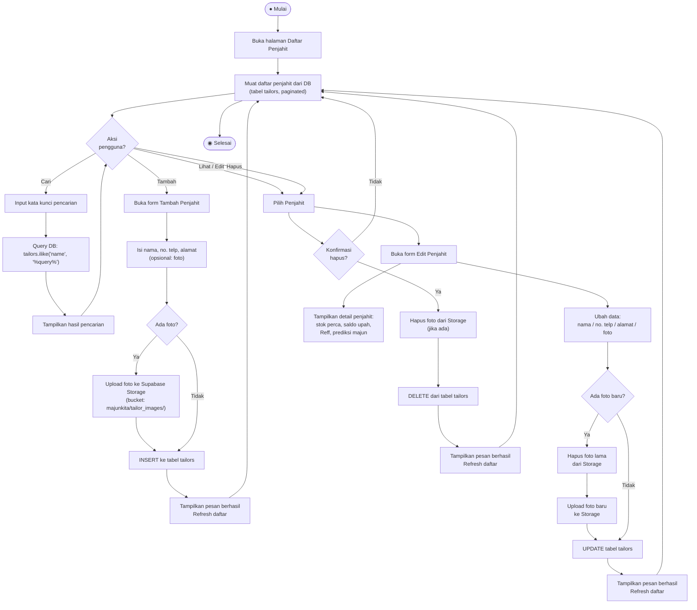

# Activity Diagram — Kelola Penjahit

**Aktor:** Admin  
**Deskripsi:** Admin dapat menambah, mengubah, melihat detail, dan menghapus data penjahit. Setiap penjahit memiliki foto profil yang disimpan di Supabase Storage.

## Langkah-langkah

| # | Aksi | Keterangan |
|---|---|---|
| 1 | Lihat daftar | Daftar penjahit dimuat dengan paginasi dari tabel `tailors` |
| 2 | Cari | Filter real-time dengan `ilike` di kolom `name` |
| 3 | Tambah | Form isi data + opsional foto → INSERT ke `tailors` |
| 4 | Edit | Ubah data → jika foto baru ada, foto lama dihapus dari Storage |
| 5 | Lihat detail | Menampilkan statistik: stok perca, saldo, Reff, prediksi majun |
| 6 | Hapus | Konfirmasi → hapus foto dari Storage → DELETE dari `tailors` |
