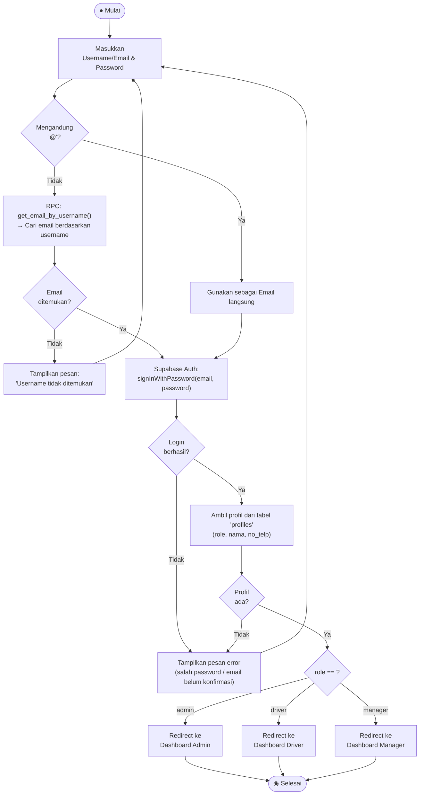

# Activity Diagram — Login

**Aktor:** Admin / Driver / Manager  
**Deskripsi:** Pengguna masuk ke sistem menggunakan email/username dan password. Sistem memetakan username ke email via RPC sebelum memanggil Supabase Auth, lalu mengarahkan ke dashboard sesuai peran.

## Langkah-langkah

| # | Langkah | Keterangan |
|---|---|---|
| 1 | Input identifier & password | Identifier bisa berupa email (mengandung `@`) atau username |
| 2 | Resolusi username → email | Jika bukan email, RPC `get_email_by_username()` dijalankan |
| 3 | Autentikasi Supabase | `signInWithPassword(email, password)` |
| 4 | Ambil profil | Query `profiles` untuk mendapatkan `role` |
| 5 | Redirect by role | Admin → Dashboard Admin, Driver → Dashboard Driver, Manager → Dashboard Manager |
