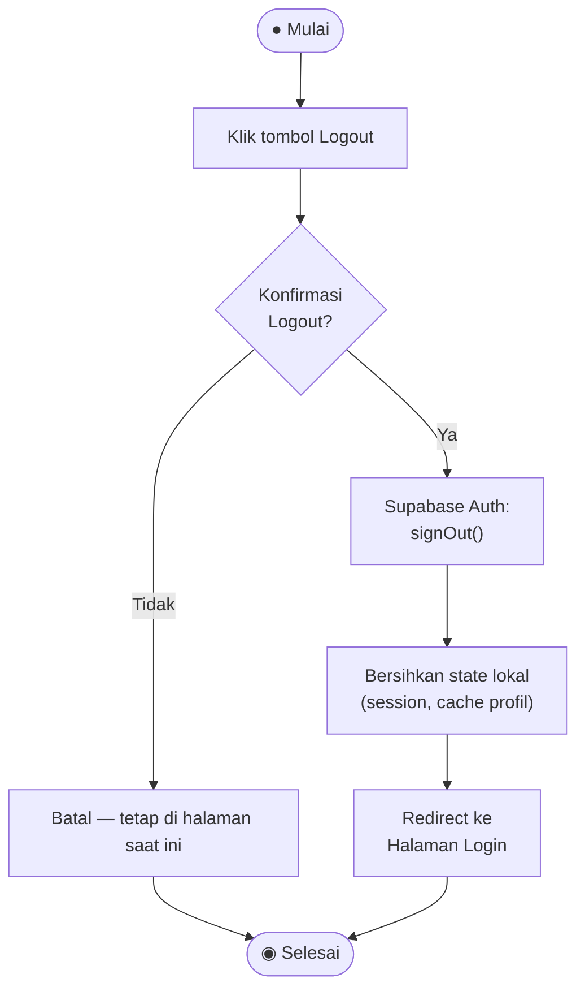

# Activity Diagram — Logout

**Aktor:** Admin / Driver / Manager  
**Deskripsi:** Pengguna keluar dari sesi aktif. Supabase menghapus token sesi, dan aplikasi mengarahkan kembali ke halaman Login.

## Langkah-langkah

| # | Langkah | Keterangan |
|---|---|---|
| 1 | Klik Logout | Pengguna menekan tombol Logout di dashboard |
| 2 | Konfirmasi | Dialog konfirmasi ditampilkan |
| 3 | `signOut()` | Supabase menginvalidasi token sesi di server |
| 4 | Clear state | State lokal (profil, data di-cache) dibersihkan |
| 5 | Redirect Login | Pengguna kembali ke halaman Login |
