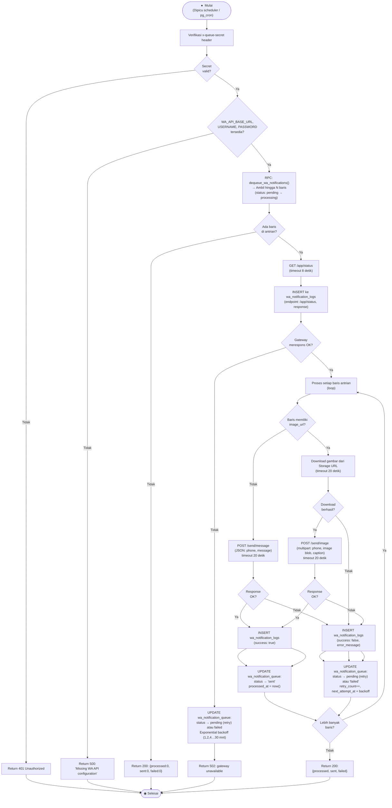

# Activity Diagram — Proses Notifikasi WhatsApp (Queue Worker)

**Aktor:** Sistem (terjadwal otomatis via pg_cron)  
**Deskripsi:** Supabase Edge Function `process-wa-notification-queue` dijalankan secara berkala oleh scheduler. Edge function mengambil antrian notifikasi pending, memeriksa status gateway WA, lalu mengirimkan pesan teks atau gambar ke penerima WhatsApp. Setiap hasil dicatat di tabel log.

## Langkah-langkah

| # | Langkah | Keterangan |
|---|---|---|
| 1 | Verifikasi secret | Header `x-queue-secret` divalidasi agar tidak bisa dipanggil sembarangan |
| 2 | Cek konfigurasi | `WA_API_BASE_URL`, `WA_API_USERNAME`, `WA_API_PASSWORD` harus tersedia |
| 3 | Dequeue | RPC `dequeue_wa_notifications()` mengunci baris dan mengubah status ke `processing` |
| 4 | Health check | GET `/app/status` ke gateway (timeout 8 detik) — jika gagal, seluruh batch di-retry |
| 5 | Kirim pesan (teks) | POST `/send/message` dengan JSON `{phone, message}` |
| 6 | Kirim pesan (gambar) | Download gambar dari Storage URL, lalu POST `/send/image` multipart |
| 7 | Catat log | Setiap percobaan pengiriman dicatat di `wa_notification_logs` |
| 8 | Update status | Berhasil → `sent`; Gagal → `pending` (retry) atau `failed` (maks retry tercapai) |
| 9 | Exponential backoff | Delay retry: 1, 2, 4, 8, … maks 30 menit |

## Tabel Trigger → Penerima WA

| Tabel Sumber | Event | Penerima | Dengan Foto |
|---|---|---|---|
| `majun_transactions` | Setor majun | Penjahit | ✅ |
| `percas_stock` | Tambah stok perca | Manager | ✅ |
| `perca_transactions` | Ambil perca | Manager | ❌ |
| `expeditions` | Pengiriman | Manager | ✅ |
| `salary_withdrawals` | Penarikan upah | Penjahit | ❌ |
