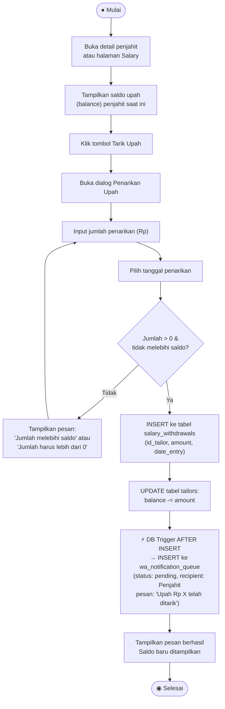

# Activity Diagram — Penarikan Upah Penjahit

**Aktor:** Admin  
**Deskripsi:** Admin memproses permintaan penarikan upah dari penjahit. Saldo penjahit dikurangi sebesar jumlah penarikan. DB trigger mengantrekan notifikasi WhatsApp ke penjahit yang bersangkutan.

## Langkah-langkah

| # | Langkah | Keterangan |
|---|---|---|
| 1 | Buka detail penjahit | Admin memilih penjahit dari daftar |
| 2 | Lihat saldo | Saldo upah yang tersedia (`balance`) ditampilkan |
| 3 | Input penarikan | Jumlah dan tanggal penarikan dimasukkan |
| 4 | Validasi | Jumlah harus > 0 dan ≤ saldo yang tersedia |
| 5 | Insert withdrawal | Transaksi disimpan ke tabel `salary_withdrawals` |
| 6 | Update saldo | `balance` penjahit dikurangi sebesar jumlah penarikan |
| 7 | Notifikasi WA | DB trigger mengantrekan notif WA ke penjahit sebagai konfirmasi penarikan |
