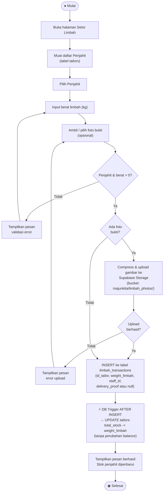

# Activity Diagram — Setor Limbah

**Aktor:** Admin  
**Deskripsi:** Admin mencatat penyerahan limbah dari penjahit. DB trigger memperbarui stok penjahit tanpa menambah upah (limbah tidak dihargai).

## Langkah-langkah

| # | Langkah | Keterangan |
|---|---|---|
| 1 | Pilih penjahit | Admin memilih penjahit dari dropdown |
| 2 | Input berat | Berat limbah dalam kg |
| 3 | Foto (opsional) | Foto bukti bersifat opsional untuk setor limbah |
| 4 | Insert DB | Transaksi disimpan ke tabel `limbah_transactions` |
| 5 | AFTER INSERT trigger | DB mengurangi `total_stock` penjahit tanpa mengubah `balance` |

> **Catatan:** Berbeda dengan Setor Majun, setor limbah **tidak menghasilkan upah** dan **tidak mengantrekan notifikasi WA**.
