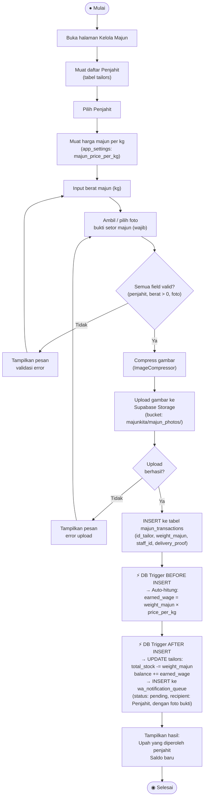

# Activity Diagram — Setor Majun

**Aktor:** Admin  
**Deskripsi:** Admin mencatat penyerahan majun dari penjahit ke gudang. DB trigger secara otomatis menghitung upah (berat × harga/kg), memperbarui saldo dan stok penjahit, serta mengantrekan notifikasi WhatsApp ke penjahit.

## Langkah-langkah

| # | Langkah | Keterangan |
|---|---|---|
| 1 | Pilih penjahit | Admin memilih penjahit dari dropdown |
| 2 | Muat harga | Harga per kg diambil dari `app_settings` |
| 3 | Input berat | Admin memasukkan berat majun yang disetor |
| 4 | Foto bukti | Wajib mengambil/memilih foto bukti setor |
| 5 | Compress & upload | Foto dikompres lalu diupload ke Storage |
| 6 | BEFORE INSERT trigger | DB menghitung `earned_wage = weight_majun × price_per_kg` secara otomatis |
| 7 | AFTER INSERT trigger | DB memperbarui `total_stock` dan `balance` penjahit, lalu enqueue notif WA |
| 8 | Tampilkan hasil | Upah dan saldo baru ditampilkan di layar |
