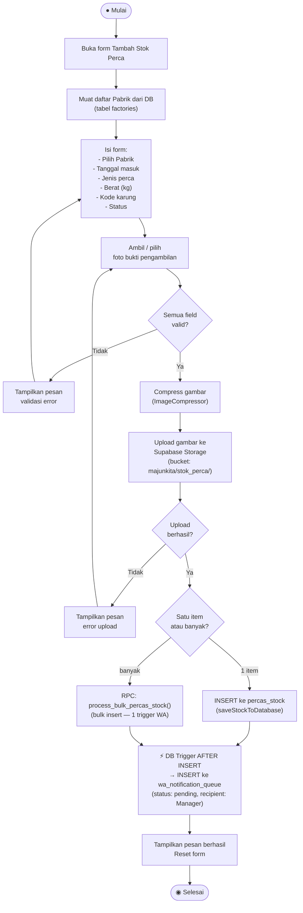

# Activity Diagram — Tambah Stok Perca

**Aktor:** Driver  
**Deskripsi:** Driver menginput data pengambilan perca dari pabrik. Setelah data dan foto bukti tersimpan, trigger database secara otomatis mengantrekan notifikasi WhatsApp ke Manager.

## Langkah-langkah

| # | Langkah | Keterangan |
|---|---|---|
| 1 | Buka form | Driver membuka halaman Tambah Stok Perca |
| 2 | Muat pabrik | Dropdown pabrik diambil dari tabel `factories` |
| 3 | Isi form | Pilih pabrik, jenis perca, berat, kode karung, tanggal, status |
| 4 | Foto bukti | Ambil/pilih foto pengambilan perca |
| 5 | Validasi | Semua field wajib harus terisi |
| 6 | Compress & upload | Gambar dikompres lalu diupload ke Supabase Storage |
| 7 | Insert DB | Data disimpan ke tabel `percas_stock` (single) atau via RPC bulk |
| 8 | Trigger WA | DB trigger mengantrekan notifikasi ke `wa_notification_queue` |
