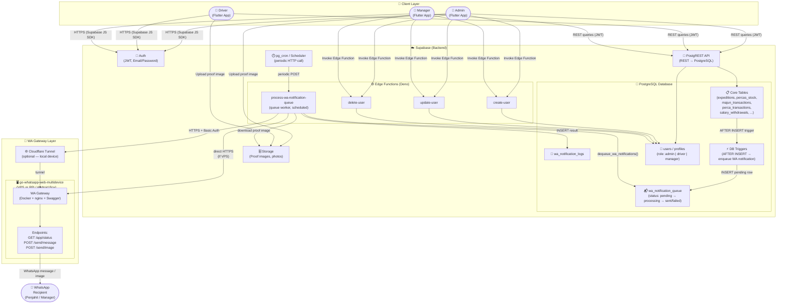

# Infrastructure Diagram — Majunkita

Diagram ini menggambarkan alur infrastruktur dari **Flutter App** (frontend) ke **Supabase** (backend) hingga **WA Gateway** (WhatsApp API).

---

## Diagram Infrastruktur



---

## Penjelasan Lapisan

### 1. Client Layer — Flutter App
- Satu aplikasi Flutter untuk tiga peran: **Admin**, **Driver**, dan **Manager**.
- Berkomunikasi dengan Supabase menggunakan **Supabase Dart SDK** melalui HTTPS.
- Auth menggunakan **JWT** berbasis Email + Password yang dikelola Supabase Auth.
- Upload foto bukti pengiriman/setor ke **Supabase Storage**.

### 2. Backend — Supabase
| Komponen | Fungsi |
|---|---|
| **Auth** | Login, logout, JWT token, manajemen sesi |
| **PostgREST** | REST API otomatis dari skema PostgreSQL |
| **PostgreSQL** | Penyimpanan data utama (expedisi, perca, majun, dll.) |
| **DB Triggers** | Setelah INSERT ke tabel utama, otomatis enqueue notifikasi WA |
| **wa_notification_queue** | Antrian notifikasi dengan status & retry logic |
| **wa_notification_logs** | Log hasil pengiriman ke WA Gateway |
| **Storage** | Penyimpanan file gambar (bukti pengiriman) |
| **Edge Functions** | Manajemen user (create/update/delete) dan pemrosesan queue WA |
| **Scheduler** | Memanggil edge function `process-wa-notification-queue` secara berkala |

### 3. WA Gateway — go-whatsapp-web-multidevice
- Self-hosted di **VPS** atau **device lokal** (Raspberry Pi / Android Box).
- Jika lokal, diteruskan ke internet via **Cloudflare Tunnel**.
- Edge function memanggil gateway dengan **Basic Auth**.
- Gateway mengirim pesan ke penerima WhatsApp melalui endpoint `/send/message` (teks) atau `/send/image` (teks + foto).

### 4. Alur Notifikasi WA (End-to-End)

```
Flutter App
    │ INSERT data (expedisi / perca / majun / salary)
    ▼
PostgreSQL Core Tables
    │ AFTER INSERT trigger
    ▼
wa_notification_queue  (status: pending)
    │ pg_cron / Scheduler (periodic)
    ▼
process-wa-notification-queue  (Edge Function)
    │ GET /app/status  → health check
    │ POST /send/message  atau  POST /send/image
    ▼
go-whatsapp-web-multidevice  ←── [Cloudflare Tunnel jika lokal]
    │
    ▼
WhatsApp Penerima (Penjahit / Manager)
    │ result
    ▼
wa_notification_logs
```

### Retry & Backoff
- Jika pengiriman gagal, baris dikembalikan ke status `pending` dengan **exponential backoff** (1, 2, 4, 8 … maks 30 menit).
- Setelah `max_retries` tercapai, status menjadi `failed`.
