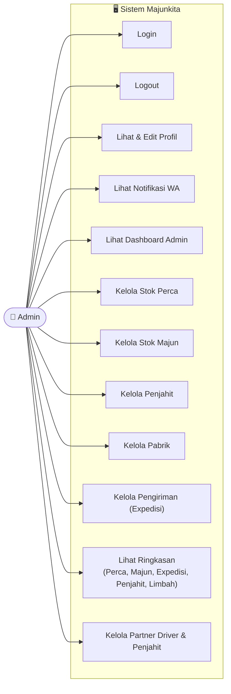

# Use Case Diagram — Admin

Diagram ini menggambarkan use case untuk peran **Admin** dalam sistem Majunkita.

## Use Case Admin

| No | Use Case | Deskripsi |
|---|---|---|
| 1 | Login | Masuk ke sistem menggunakan akun Admin |
| 2 | Logout | Keluar dari sistem |
| 3 | Lihat & Edit Profil | Melihat dan mengubah data profil sendiri |
| 4 | Lihat Notifikasi WA | Melihat notifikasi yang dikirim via WhatsApp |
| 5 | Lihat Dashboard Admin | Melihat ringkasan data di halaman utama Admin |
| 6 | Kelola Stok Perca | Menambah, mengubah, dan menghapus data stok perca |
| 7 | Kelola Stok Majun | Menambah, mengubah, dan menghapus data stok majun |
| 8 | Kelola Penjahit | Mengelola data penjahit |
| 9 | Kelola Pabrik | Mengelola data pabrik |
| 10 | Kelola Pengiriman (Expedisi) | Mengelola data pengiriman/expedisi |
| 11 | Lihat Ringkasan | Melihat ringkasan Perca, Majun, Expedisi, Penjahit, dan Limbah |
| 12 | Kelola Partner Driver & Penjahit | Menambah atau menonaktifkan akun Driver dan Penjahit |

> **Catatan:** Admin tidak dapat mengelola sesama Admin. Pengelolaan akun Admin hanya dapat dilakukan oleh Manager.
