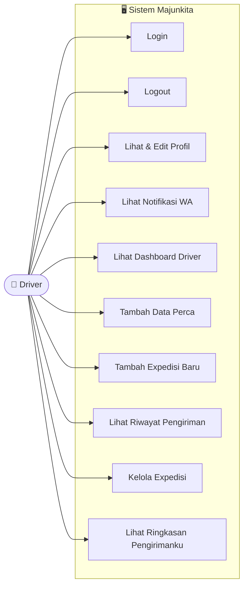

# Use Case Diagram — Driver

Diagram ini menggambarkan use case untuk peran **Driver** dalam sistem Majunkita.

## Use Case Driver

| No | Use Case | Deskripsi |
|---|---|---|
| 1 | Login | Masuk ke sistem menggunakan akun Driver |
| 2 | Logout | Keluar dari sistem |
| 3 | Lihat & Edit Profil | Melihat dan mengubah data profil sendiri |
| 4 | Lihat Notifikasi WA | Melihat notifikasi yang dikirim via WhatsApp |
| 5 | Lihat Dashboard Driver | Melihat ringkasan data di halaman utama Driver |
| 6 | Tambah Data Perca | Menginput data pengambilan perca dari pabrik |
| 7 | Tambah Expedisi Baru | Membuat catatan pengiriman baru |
| 8 | Lihat Riwayat Pengiriman | Melihat daftar pengiriman yang pernah dilakukan |
| 9 | Kelola Expedisi | Mengubah atau memperbarui data expedisi milik sendiri |
| 10 | Lihat Ringkasan Pengirimanku | Melihat statistik pengiriman yang telah dilakukan |
