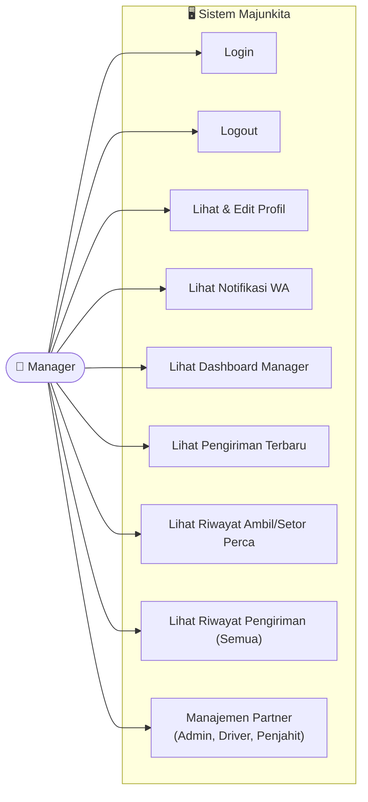

# Use Case Diagram — Manager

Diagram ini menggambarkan use case untuk peran **Manager** dalam sistem Majunkita.

## Use Case Manager

| No | Use Case | Deskripsi |
|---|---|---|
| 1 | Login | Masuk ke sistem menggunakan akun Manager |
| 2 | Logout | Keluar dari sistem |
| 3 | Lihat & Edit Profil | Melihat dan mengubah data profil sendiri |
| 4 | Lihat Notifikasi WA | Melihat notifikasi yang dikirim via WhatsApp |
| 5 | Lihat Dashboard Manager | Melihat ringkasan data di halaman utama Manager |
| 6 | Lihat Pengiriman Terbaru | Melihat daftar expedisi terbaru dari semua Driver |
| 7 | Lihat Riwayat Ambil/Setor Perca | Melihat riwayat pengambilan dan penyetoran perca |
| 8 | Lihat Riwayat Pengiriman (Semua) | Melihat seluruh riwayat pengiriman lintas Driver |
| 9 | Manajemen Partner | Menambah atau menonaktifkan akun Admin, Driver, dan Penjahit |

> **Catatan:** Manager memiliki kewenangan penuh atas pengelolaan akun, termasuk akun Admin.
