# Use Case Diagram — Majunkita

Diagram ini menggambarkan use case untuk tiga peran utama dalam sistem: **Admin**, **Driver**, dan **Manager**.

```mermaid
flowchart LR
    %% ── Actors ──────────────────────────────────────────────────
    Admin(["👤 Admin"])
    Driver(["🚚 Driver"])
    Manager(["👔 Manager"])

    %% ── System boundary ─────────────────────────────────────────
    subgraph Sistem["🖥️ Sistem Majunkita"]

        %% Shared
        UC_Login["Login"]
        UC_Logout["Logout"]
        UC_Profile["Lihat & Edit Profil"]
        UC_Notif["Lihat Notifikasi WA"]

        %% Admin
        UC_A_Dash["Lihat Dashboard Admin"]
        UC_A_Perca["Kelola Stok Perca"]
        UC_A_Majun["Kelola Stok Majun"]
        UC_A_Penjahit["Kelola Penjahit"]
        UC_A_Pabrik["Kelola Pabrik"]
        UC_A_Exp["Kelola Pengiriman (Expedisi)"]
        UC_A_Summary["Lihat Ringkasan\n(Perca, Majun, Expedisi, Penjahit, Limbah)"]
        UC_A_Partner["Kelola Partner Driver & Penjahit"]

        %% Driver
        UC_D_Dash["Lihat Dashboard Driver"]
        UC_D_AddPerca["Tambah Data Perca"]
        UC_D_AddExp["Tambah Expedisi Baru"]
        UC_D_HistExp["Lihat Riwayat Pengiriman"]
        UC_D_ManExp["Kelola Expedisi"]
        UC_D_Summary["Lihat Ringkasan Pengirimanku"]

        %% Manager
        UC_M_Dash["Lihat Dashboard Manager"]
        UC_M_LatestExp["Lihat Pengiriman Terbaru"]
        UC_M_PercaHist["Lihat Riwayat Ambil/Setor Perca"]
        UC_M_ExpHist["Lihat Riwayat Pengiriman (Semua)"]
        UC_M_Partner["Manajemen Partner\n(Admin, Driver, Penjahit)"]
    end

    %% ── Shared connections ───────────────────────────────────────
    Admin   --> UC_Login
    Driver  --> UC_Login
    Manager --> UC_Login

    Admin   --> UC_Logout
    Driver  --> UC_Logout
    Manager --> UC_Logout

    Admin   --> UC_Profile
    Driver  --> UC_Profile
    Manager --> UC_Profile

    Admin   --> UC_Notif
    Driver  --> UC_Notif
    Manager --> UC_Notif

    %% ── Admin connections ────────────────────────────────────────
    Admin --> UC_A_Dash
    Admin --> UC_A_Perca
    Admin --> UC_A_Majun
    Admin --> UC_A_Penjahit
    Admin --> UC_A_Pabrik
    Admin --> UC_A_Exp
    Admin --> UC_A_Summary
    Admin --> UC_A_Partner

    %% ── Driver connections ───────────────────────────────────────
    Driver --> UC_D_Dash
    Driver --> UC_D_AddPerca
    Driver --> UC_D_AddExp
    Driver --> UC_D_HistExp
    Driver --> UC_D_ManExp
    Driver --> UC_D_Summary

    %% ── Manager connections ──────────────────────────────────────
    Manager --> UC_M_Dash
    Manager --> UC_M_LatestExp
    Manager --> UC_M_PercaHist
    Manager --> UC_M_ExpHist
    Manager --> UC_M_Partner
```

## Ringkasan Use Case per Peran

| Use Case | Admin | Driver | Manager |
|---|:---:|:---:|:---:|
| Login / Logout | ✅ | ✅ | ✅ |
| Lihat & Edit Profil | ✅ | ✅ | ✅ |
| Lihat Notifikasi WA | ✅ | ✅ | ✅ |
| Lihat Dashboard (per role) | ✅ | ✅ | ✅ |
| Kelola Stok Perca | ✅ | — | — |
| Kelola Stok Majun | ✅ | — | — |
| Kelola Penjahit | ✅ | — | — |
| Kelola Pabrik | ✅ | — | — |
| Kelola Pengiriman (Expedisi) | ✅ | ✅ | — |
| Lihat Ringkasan (Perca, Majun, Expedisi, Penjahit, Limbah) | ✅ | — | — |
| Tambah Data Perca | — | ✅ | — |
| Tambah Expedisi Baru | — | ✅ | — |
| Lihat Riwayat Pengirimanku | — | ✅ | — |
| Lihat Ringkasan Pengirimanku | — | ✅ | — |
| Lihat Pengiriman Terbaru | — | — | ✅ |
| Lihat Riwayat Ambil/Setor Perca | — | — | ✅ |
| Lihat Riwayat Pengiriman (Semua) | — | — | ✅ |
| Manajemen Partner Driver & Penjahit | ✅ | — | — |
| Manajemen Partner Admin, Driver & Penjahit | — | — | ✅ |

> **Catatan:** Admin hanya dapat mengelola Driver dan Penjahit (tidak bisa mengelola sesama Admin). Manager dapat mengelola Admin, Driver, dan Penjahit.
